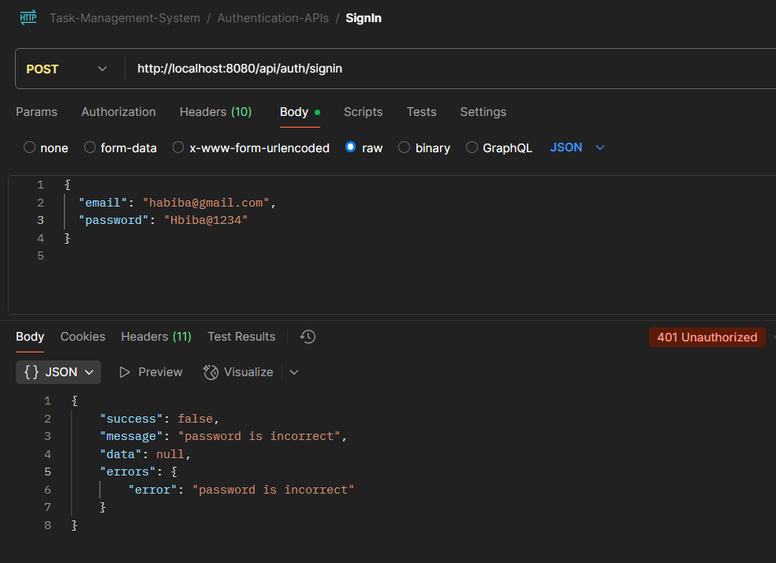

# Task Management System Documentation

## Overview
This is a RESTful Task Management System built with Spring Boot. It allows users to manage their daily tasks efficiently and subscribe to periodic task reports via email. The system supports user registration, authentication using JWT, task CRUD operations with soft delete and restore functionality, and subscription management for receiving scheduled reports.

## Key Features
- User registration and login with JWT-based authentication.
- Create, read, update, soft delete, and restore tasks.
- Task validation including mandatory title on creation.
- Subscription service for daily, weekly, or monthly email reports.
- Robust input validation and consistent error handling.
- Secure endpoints accessible only to authorized users.

## Problems Solved
- Prevents unauthorized access and updates to tasks.
- Avoids duplicate subscriptions per user.
- Handles partial updates on tasks and subscriptions.
- Validates inputs like dates, enums, and report hours.
- Provides clear and user-friendly API error responses.

---

## Technologies Used
- **Java 17** - Programming language
- **Spring Boot** - Framework for REST APIs and dependency injection
- **Spring Security + JWT** - Authentication and authorization
- **Hibernate + JPA** - ORM and database interaction
- **MySQL** - Relational database
- **Maven** - Build tool and dependency management
- **Postman & Swagger** - API testing and documentation

## Architecture Overview
- **Layers:** Controller, Service, Repository, Model
- **Security:** JWT token validation on every request
- **Database:** Relational schema with User, Task, Subscription tables
- **Validation:** Bean Validation with groups for create/update differentiation
- **Exception Handling:** Global @ControllerAdvice for consistent API error responses

## API Endpoints Summary
| Method | Endpoint                | Description                     | Auth Required |
|--------|-------------------------|--------------------------------|---------------|
| POST   | `/auth/register`        | Register a new user             | No            |
<table>
  <tr>
    <td></td>
    <td></td>
  </tr>
  <tr>
    <td></td>
    <td></td>
  </tr>
</table>
| POST   | `/auth/login`           | Login and get JWT               | No            |
<table>
  <tr>
    <td></td>
    <td></td>
  </tr>
</table>
| GET    | `/tasks`                | Get user tasks                 | Yes           |
<table>
  <tr>
    <td></td>
    <td></td>
  </tr>
  <tr>
    <td></td>
    <td></td>
  </tr>
</table>
| POST   | `/tasks`                | Create a new task               | Yes           |
<table>
  <tr>
    <td></td>
    <td></td>
  </tr>
  <tr>
    <td></td>
    <td></td>
  </tr>
  <tr>
    <td></td>
    <td></td>
  </tr>
</table>
| PUT    | `/tasks/{id}`           | Update task partially          | Yes           |
<table>
  <tr>
    <td></td>
    <td></td>
  </tr>
</table>
| DELETE | `/tasks/{id}`           | Soft delete a task             | Yes           |
<table>
  <tr>
    <td></td>
    <td></td>
  </tr>
</table>
| DELETE | `/tasks/batch`           | delete batch of tasks             | Yes           |
<table>
  <tr>
    <td></td>
    <td></td>
  </tr>
  <td></td>
</table>
| PUT    | `/tasks/{id}/restore`   | Restore a soft deleted task    | Yes           |
<table>
  <tr>
    <td></td>
  </tr>
</table>
| POST   | `/subscriptions`        | Subscribe for reports           | Yes           |
<table>
  <tr>
    <td></td>
    <td></td>
  </tr>
  <tr>
    <td></td>
    <td></td>
  </tr>
  <tr>
    <td></td>
    <td></td>
  </tr>validatestartdate.PNG
</table>
| PUT    | `/subscriptions`        | Update subscription             | Yes           |
<table>
  <tr>
    <td></td>
    <td></td>
  </tr>
</table>
| DELETE | `/subscriptions`           | Unsubscripe             | Yes           |
<table>
  <tr>
    <td></td>
    <td></td>
  </tr>
</table>
| GET    | `/reports/test`                | Report Generation   | Yes           |              
<table>
  <tr>
    <td></td>
    <td></td>
  </tr>
</table>

## Validation Rules
- Task **title** is mandatory on creation, optional on update.
- Report hour must be an integer between 0 and 23.
- Subscription start date cannot be in the past.
- User cannot have more than one active subscription.
- Only owners can update/delete their tasks.

## Error Handling
- Consistent error response format with `success`, `message`, `data`, and `errors`.
- Common error cases:
  - Invalid input format (dates, enums, numbers)
  - Unauthorized access
  - Resource not found
  - Business logic violations (e.g., duplicate subscription)
### 📊 ER Diagram

![ER Diagram]
<td></td>

